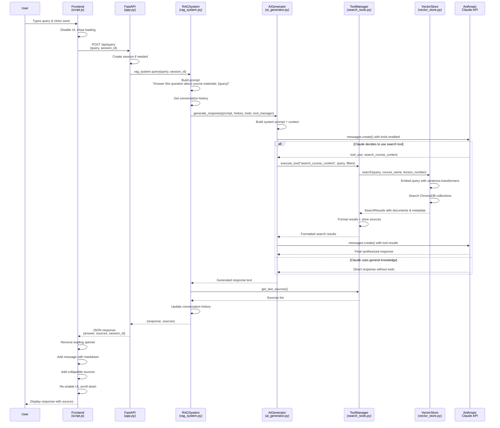
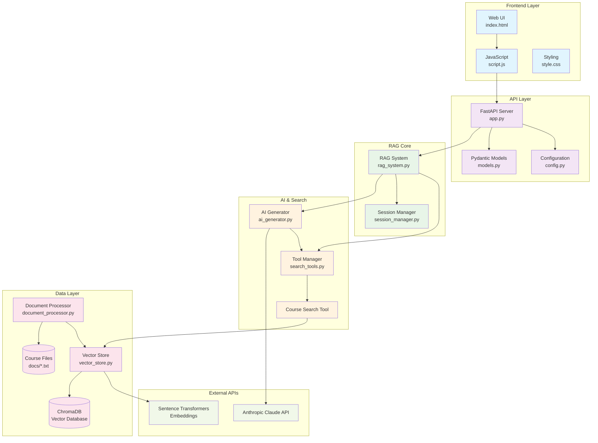

# RAG System Query Processing Flow

## Component Architecture

## Data Flow Summary

1. **User Input** → Frontend captures and validates
2. **HTTP Request** → FastAPI receives and routes
3. **RAG Orchestration** → Coordinates all components
4. **AI Decision** → Claude determines if search is needed
5. **Tool Execution** → Semantic search in vector database
6. **Response Synthesis** → Claude combines search results
7. **UI Update** → Display response with sources

## Key Technologies

- **Frontend**: Vanilla JavaScript, HTML5, CSS3
- **Backend**: Python FastAPI, Pydantic
- **AI**: Anthropic Claude API with tool calling
- **Vector DB**: ChromaDB with sentence-transformers
- **Search**: Semantic similarity matching
- **Session**: In-memory conversation history